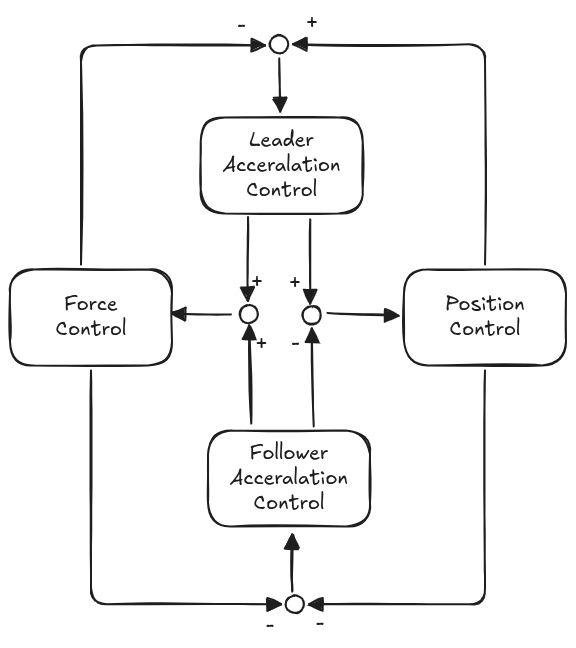

# OpenArm Bilateral Control

This repository contains the bilateral control implementation for OpenArm, a robotic platform developed by the Reazon Human Intelligence Research Lab.

## What is the bilateral control?
Bilateral control is a technique in which the force experienced by a follower robot is fed back to the leader in real-time.  
By combining **position control** and **force control**, it enables smooth manipulation and intuitive force feedback, allowing the operator to physically feel what the follower robot is touching.

We implement a **4-channel bilateral control architecture**, which allows independent transmission of both position and force signals in each direction between the leader and follower.  
This enhances stability and responsiveness, making it suitable for precise teleoperation tasks.

Our system performs **sensorless force estimation**, and is based on **disturbance observer-based acceleration control**.  
This approach enables accurate and responsive force control without the need for dedicated force sensors.


<p align="center">
  
  <br/>
  <em>Figure: 4ch bilateral control architecture</em>
</p>

## Supported ROS 2 Distributions

This package supports the following ROS 2 distributions:

- [Humble](https://github.com/rt-net/crane_x7_description/tree/humble)


## Pre require

clone and build the openarm_ros2 package

[openarm_ros2](https://github.com/reazon-research/openarm_ros2/tree/main)

```console
$ mkdir -p ~/ros2_ws/src
$ cd ~/ros2_ws/src
$ git clone git@github.com:reazon-research/openarm_ros2.git
# Initialize rosdep (only needed the first time)
$ sudo rosdep init
$ rosdep update
$ rosdep install --from-paths src -y --ignore-src -r
# Build the ros2_package
$ colcon build --base-paths src/openarm_ros2 && source install/setup.bash
```

## Installation

```console
# Setup ROS environment
$ source /opt/ros/humble/setup.bash
$ cd ~/ros2_ws/src
$ git clone url to bilateral

# Initialize rosdep (only needed the first time)
$ sudo rosdep init

# Install dependencies
$ sudo apt-get update
$ rosdep update
$ rosdep install -i --from-path src/openarm_bilateral/ -y

# Build the package
$ cd ~/ros2_ws
$ colcon build --packages-select openarm_bilateral && source install/setup.bash
```

## Quick Start

set up can device
The following USB2CANFD devices have been tested and confirmed to work:

[USB2CANFD1](https://qr.paps.jp/yFSS7n)

If you are using a different device, make sure it is compatible with SocketCAN and supports CAN FD (ISO 11898-1) if required.

The following script is configured to set up the CAN FD interface  
with a nominal bitrate of **1 Mbps** and a data phase bitrate of **5 Mbps**.

The CAN interface assignment for the dual-arm setup is defined as:

- `can0`: Right arm leader
- `can1`: Right arm follower
- `can2`: Left arm leader
- `can3`: Left arm follower

Ensure that each USB2CANFD device is physically connected in accordance with this mapping.

Install CAN utilities
before configuring the CAN device, install the necessary utilities:

```console
$ sudo apt update
$ sudo apt install can-utils
```
connect can device
```console
# Connect the leader-side USB2CAN to your PC
$ socketcanfd_setting.sh can0
$ socketcanfd_setting.sh can1
# Then, connect the follower-side USB2CAN devices
$ socketcanfd_setting.sh can2
$ socketcanfd_setting.sh can3
```

### Running Bilateral Control

```console
# if right arm
$ ros2 launch openarm_bilateral rightarm_bilateralcontrol.launch.py 
# if left arm
$ ros2 launch openarm_bilateral leftarm_bilateralcontrol.launch.py 
```

### Running Unilateral Control

```console
# if right arm
$ ros2 launch openarm_bilateral rightarm_unilateralcontrol.launch.py 
# if left arm
$ ros2 launch openarm_bilateral leftarm_unilateralcontrol.launch.py 
```

## ⚠️ Caution

 Please make sure that the motor's zero position corresponds to the default posture with the arm pointing straight downward.
 If not, perform calibration and write the correct zero position to the motor.

Bilateral control that includes force feedback requires **high-bandwidth communication**, typically at **1 kHz or higher**.  
Please note that using **Classic CAN** may lead to unstable behavior due to its limited bandwidth.  
We recommend using **CAN FD** for stable and responsive force control.

## Code of Conduct

All participation in the OpenArm Bilateral Control project is governed by our
[Code of Conduct](CODE_OF_CONDUCT.md).

## Development

### Directory Structure

Below is the directory structure of this OpenArm Bilateral Control's repository.

```text
.
|-- CMakeLists.txt                                  # CMake build configuration file
|-- config                                          # ROS 2 node parameter configurations
|   |-- follower.yaml                               # parameters for the follower arm
|   `-- leader.yaml                                 # parameters for the leader arm
|-- docker
|   `-- Dockerfile                                  # Docker setup for ROS 2 + OpenArm
|-- fig                                             # figures (e.g., control diagrams)
|   `-- 4chbilate.png                               # 4-channel bilateral control diagrams
|-- launch                                          # ROS 2 launch files
|   |-- leftarm_bilateralcontrol.launch.py          # launch left-arm bilateral control
|   |-- leftarm_unilateralcontrol.launch.py         # launch left-arm unilateral control
|   |-- rightarm_bilateralcontrol.launch.py         # launch right-arm bilateral control
|   |-- rightarm_bilateralcontrol_logging.launch.py # launch right-arm bilateral control with logging enabled
|   `-- rightarm_unilateralcontrol.launch.py        # launch right-arm unilateral control
|-- LICENSE
|-- package.xml                                     # ROS 2 package manifest
|-- README.md                                       # project overview
|-- samples                                         # sample code for validation tests
|   |-- canfd_test.cpp                              # CAN-FD communication test
|   |-- check_dynamics.cpp                          # dynamics calculation verification
|   |-- check_grav_comp.cpp                         # gravity compensation check
|   `-- constant_speed_test.cpp                     # constant-speed behavior test
|-- script                                          # helper scripts and utilities
|   |-- data_plot.py                                # log visualization tool
|   |-- socketcan_control                           # Python CAN control utilities
|   |   |-- DM_SocketCANFD.py                       # SocketCAN FD support library
|   |   |-- README.md
|   |   |-- calibrate.py                            # motor calibration
|   |   |-- canfd_test.py
|   |   |-- change_baudrate.py                      # CAN baud-rate changer
|   |   |-- go_to_pose.py                           # move to specified pose
|   |   |-- read_motor_param.py                     # read motor parameters
|   |   |-- read_only.py                            # read-only mode
|   |   |-- record.py                               # data collection script
|   |   |-- replay.py                               # log replay script
|   |   |-- requirements.txt
|   |   `-- switch_controlmode.py                   # switch control modes
|   |-- socketcan_setting.sh
|   |-- socketcanfd_setting.sh
|   |-- test_fric_plot.py                           # friction model visualization
|   |-- torque_velocity_plot.py                     # torque vs. velocity plot
|   `-- vel_compare.py                              # velocity profile comparison
`-- src                                             # main C++ source file
    |-- bilateral_main.cpp                          # entry-point implementation
    |-- bilateral_main_logging.cpp                  # entry point with logging enabled
    |-- canfd                                       # CAN-FD communication modules
    |   |-- canbus.cpp                              # CAN-FD communication
    |   `-- canbus.hpp
    |-- controller                                  # control algorithm modules
    |   |-- control.cpp                             # core control logic
    |   |-- control.hpp
    |   |-- diff.hpp                                # differential processing (maybe unused)
    |   |-- dynamics.cpp                            # dynamics calculation
    |   |-- dynamics.hpp
    |   `-- global.hpp                              # global constants, etc.
    `-- dmmotor                                     # Damiao motor control modules
        |-- damiao_port.cpp                         # motor-port initialization
        |-- damiao_port.hpp
        |-- motor.cpp                               # abstract motor class
        |-- motor.hpp
        |-- motor_control.cpp                       # group motor control
        `-- motor_control.hpp
```
